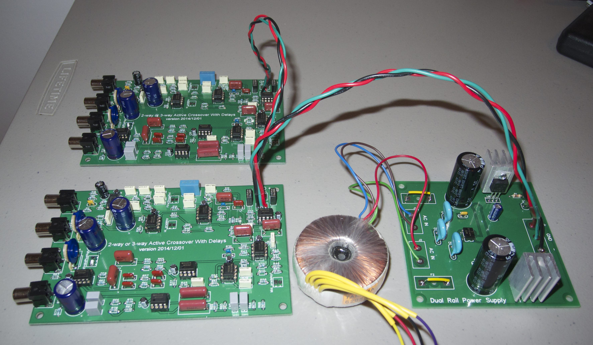

## Overview
This repo contains various things that were used to help in the design and building of an analog active crossover with delays.

Some things you'll find in the repo:
* python utilities for help in selecting optimal capacitor and resistor values for a Sallen-Key topology active filter
* DipTrace schematic files and PCB layouts
* PCB gerbers (both for the crossover circuit PCB and a corresponding dual-rail power supply)
* Pictures of the results

## Background
The design is based off a design contained in Douglas Self's excellent book "The Design of Active Crossovers".

## Isaac's DIY Project

The nearly final product of this DIY product consists of these two working crossover/delay boards and their power supply:

Now I just need to put these in an enclosure of some kind (and add those two missing fuses you may have noticed in the picture). After doing this I'll measure the frequency response and noise floor more carefully.

